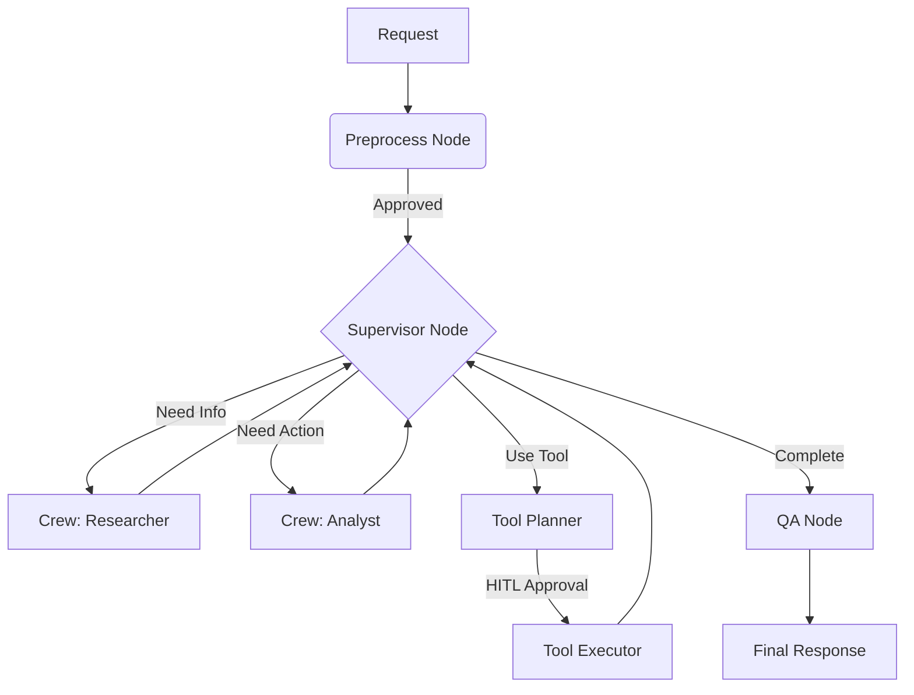

# Sfeir Backend: The "Brain" & "Crew" Hybrid Architecture

> [!IMPORTANT]
> This is not a standard CRUD backend. It is an **Agentic Orchestration Layer** designed to bridge the gap between deterministic state management (LangGraph) and autonomous task execution (CrewAI).

## 1. Engineering Philosophy

We reject the "black box" approach to AI agents. Instead, we treat agents as **deterministically routed, visible units of work**.

### A. The Hybrid Model: LangGraph 🤝 CrewAI

- **LangGraph as the Brain**: We do _not_ rely on CrewAI's internal loops for high-level orchestration. LangGraph acts as the state machine, holding the "Global Truth" (History, Research Context, Tool Outputs). It decides _who_ runs next (Supervisor Node).
- **CrewAI as the Worker**: CrewAI is strictly used for _execution_. When LangGraph routes to a "Researcher", it spins up a ephemeral Crew to perform that specific task and return a result. The Crew does not decide the overall flow; the Brain does.

### B. Protocol-First (MCP)

- We do not hardcode tools. We use the **Model Context Protocol (MCP)**.
- Agents (via LLM) "plan" a tool call, but the **System** executes it. This allows for Human-in-the-Loop (HITL) interception before any external side effect guarantees safety and auditability.

### C. Rigorous Standards

- **Dependency Management**: We use `uv`. It is orders of magnitude faster than pip/poetry and ensures bit-exact deterministic environments.
- **Async-First**: Python's `asyncio` is non-negotiable here. Long-running AI tasks must not block the main event loop. We use `AsyncPostgresSaver` for persistence.
- **Type Safety**: Pydantic for everything. No loose dicts passed around as "context".
- **ORM & Migrations**: `SQLModel` (pydantic-native ORM) and `Alembic` for confident schema evolution.
- **Task Running**: `poethepoet` for unified dev commands.

## 2. Architecture Overview



### Core Components

- **Supervisor Node**: The "Router". Uses an LLM to look at history and decide the next step (Parallel or Sequential).
- **Nodes**: Pure functions transforming `GraphState`.
- **Persistence**: Every step is checkpointed to Postgres. Time-travel, resume, and fork supported.

### Capabilities & Tools

Built on **FastMCP** and standard Python async libraries:

- **File Operations**: Safe, jailboxed filesystem access via `files.py`.
- **AWS S3**: Async S3 interaction via `aioboto3` (`s3.py`).
- **MCP Integration**: Extensible Model Context Protocol support (`mcp.py`).
- **Adapter Layer**: Unified interface for external tools (`adapter.py`).

### CrewAI Integration

- **Custom LLM Wrapper**: Specialized wrapping to make CrewAI agents play nicely with our async event loop.
- **Task Definitions**: Explicit tasks defined in `src/crew/tasks.py` for "Researcher" and "Analyst" roles.

## 3. Developer Guide

### Setup

We enforce `uv` for all operations.

```bash
# 1. Install dependencies
uv sync

# 2. Run the server (Dev)
uv run poe dev
# OR directly: uv run uvicorn src.api.main:app --reload

# 3. Code Quality (Strict)
uv run ruff check .
```

### API & Streaming

The backend exposes a **V1 API** (`src/api/v1`) optimized for streaming:

- **SSE (Server-Sent Events)**: Real-time graph updates, token streaming, and tool execution logs.
- **Resumable Workflows**: Pass a `thread_id` and `checkpoint_id` to branch off any point in history.

### Adding a New Agent

1. **Define Configuration**: Create a YAML file in `src/config/agents/`.
2. **Register**: The `AgentRegistry` automatically loads it.
3. **Usage**: The `Supervisor` will dynamically become aware of it.

### Testing

We use `pytest` with `expects` for readable assertions.

```bash
uv run pytest
```

_Note: Tests must be stateless. Mock external LLM calls unless running integration tests._
