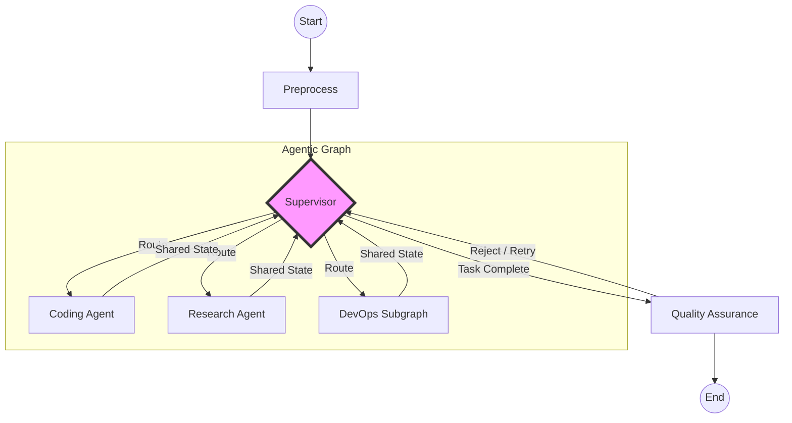

# AWP Cognitive Architecture
## Executive Technical Overview

**Subject:** Next-Gen Agentic Orchestration & Industrialized GenAI Flow

### 1. The Paradigm Shift: From Chains to Cyclic Graphs

The AWP Architecture represents a departure from brittle, linear LLM chains towards a robust, **Cyclic State Graph**. By leveraging **Semantic Orchestration** and **Deterministic State Machines**, the system moves beyond simple "chatbots" into the realm of **Autonomous Multi-Agent Systems (MAS)** capable of complex, multi-step problem solving.

This platform is an **Industrialized GenAI Operating System** prioritizing **Reliability and Correctness** over raw speed.

---

### 2. High-Level Architecture: The "Brain" Core

The core execution environment relies on a compiled **StateGraph** (powered by LangGraph) that manages the lifecycle of a request. This ensures type-safe state transitions, distributed checkpointing (via Postgres), and resumable execution workflows.

#### **The Core Loop (Reflexion Pattern)**
The system implements an advanced variation of the standard "Plan-and-Execute" pattern, internally referred to as **"ReAct ++"** (ReAct with Integrated Reflexion):

1.  **Ingestion & Preprocessing**: Raw requests are normalized and semantically enriched.
2.  **The Supervisor (The "Brain")**: A central routing node that formulates a **Strategic Plan**. It utilizes **DyLAN (Dynamic Learning Agent Network)** heuristics to select the highest-performing agents.
3.  **The Agentic Graph**: A dynamic layer of specialized "Atomic Agents" (Workers) and "Superagent Teams" (Subgraphs).
4.  **Tri-State Reflection**: Agents critique their own work (Approved, Fixed, Rejected) *before* submission, catching errors early.
5.  **Aggregation & QA**: A final consolidation layer ensuring the output meets strict schema requirements.

---

### 3. Orchestration Flow: Semantic Decision Engine

The **OrchestratorService** serves as the system's prefrontal cortex. It replaces hard-coded logic with **Probabilistic Decision Making** constrained by strict schemas.

*   **Context-Aware Routing**: The Orchestrator analyzes the **Global Shared State** (not just the last message) to determine the *Next Best Action*.
*   **Structured Output Enforcement**: All decisions are emitted as strictly typed Pydantic models.
*   **DyLAN Scoring (Experimental)**: A capability registry that ranks agents based on historical success rates. *Note: Currently utilizes heuristic feedback loops to minimize "judging" bias.*

---

### 4. Execution Flow: The "Worker" & MCP Integration

Execution is about instantiating an ephemeral **Worker Context** that solves a specific slice of the problem.

#### **Protocol: Model Context Protocol (MCP)**
We utilize **FastMCP** (Anthropic Standard) to standardize tool exposure. This decouples the "Intelligence" (LLM) from the "Capabilities" (Tools).
*   **Universal Tooling**: Capabilities like `filesystem` or `s3` are hot-swappable via distinct MCP servers (*assuming standardized interface contracts*).

#### **Voyager Skill Library (Beta)**
Successful code executions are vectorized and stored in a **Semantic Skill Library**.
*   *Risk Mitigation*: To prevent "Context Pollution" and "Code Rot", the library implements strict expiry policies and relevance filtering (k=3), forcing agents to adapt old patterns rather than copy-paste blindly.

#### **The Self-Correction Loop**
1.  **Draft**: Agent generates a solution.
2.  **Critique**: The `REFLECTION` prompt analyzes the output against the request.
3.  **Refine**: The agent auto-fixes syntax errors or logic gaps.
4.  **Safety Valve**: A strict **Max Retry Budget** (e.g., 3 attempts) prevents "infinite stubbornness loops", escalating to human intervention or graceful failure if unresolved.

---

### 5. Performance & Latency (The "Industrial Tax")

Unlike real-time chatbots, this architecture is designed as an **Asynchronous Job Processor**.

*   **Latency Cost**: A single high-complexity request involves multiple LLM hops (Orchestrator -> Worker -> Reflector -> QA).
*   **Budget Estimation**: multi-step tasks may take **30-60 seconds**.
*   **Justification**: The tradeoff is **Accuracy**. By "thinking fast and slow" (System 2 thinking), we reduce hallucination rates for critical enterprise tasks.
*   **Cost & Safety**: To prevent runaway loops, the graph implements a strict **Max-Step Limit (Recursion Cap)** and a **Token Budget Monitor**, halting execution if the reflection cycle exceeds defining thresholds.

---

### 6. Node Flow: The Graph Topology

The architecture is defined by a directed cyclic graph with the following topology:

*   **Shared State**: All nodes read/write to a global Postgres-backed state object, preventing "telephone game" data loss between layers.

---

### Appendix: Cognitive Glossary

| Term | Definition |
| :--- | :--- |
| **ReAct ++** | *Internal Nomenclature*. An evolution of the standard ReAct loop that adds **Tri-State Reflection** (Self-Correction) and **Strategic Planning**, effectively implementing the "Reflexion" paper pattern. |
| **Cyclic State Graph** | The network of interconnected agents and subgraphs (powered by LangGraph) allowing for non-linear, cyclic problem solving (loops) rather than linear chains. |
| **DyLAN** | *Dynamic Learning Agent Network*. A heuristic scoring system to rank agent effectiveness. Currently utilizes binary success/failure signals to bias agent selection. |
| **FastMCP** | Implementation of the *Model Context Protocol*, standardizing tool exposure and decoupling "Brain" from "Tools". |
| **Voyager Library** | A semantic long-term memory store for code patterns. Implements "RAG for Logic" to bootstrap agents with past solutions. |
