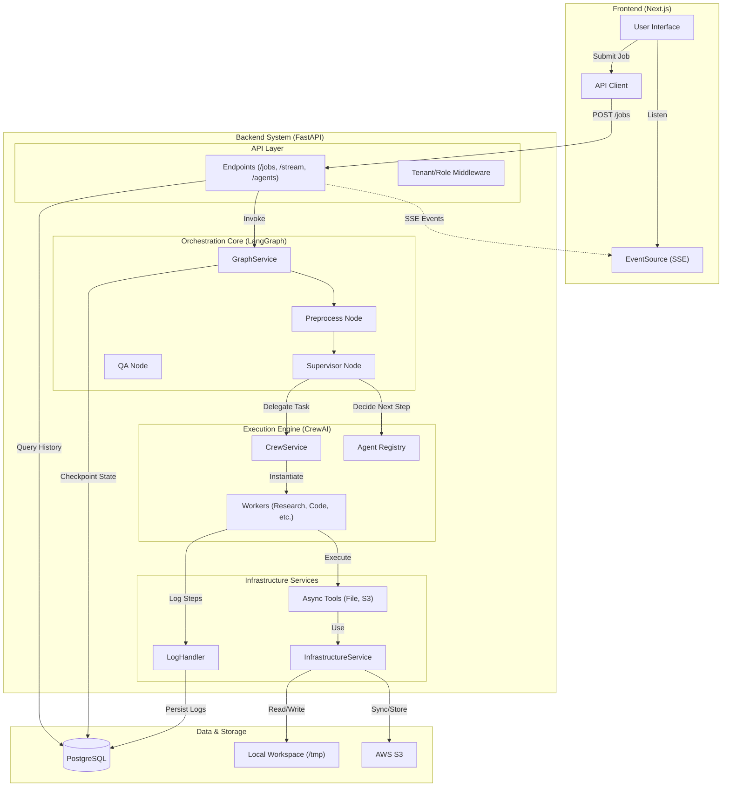
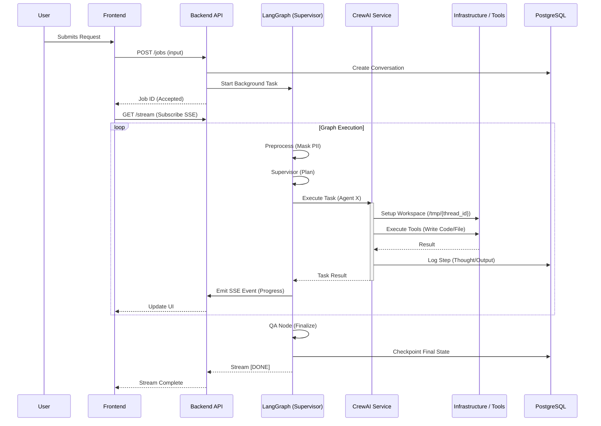

# Technical Architecture & Flow

This document outlines the technical infrastructure and data flow architecture of the Mnabaa Agentic Platform.

## High-Levels Architecture

## Detailed Execution Flow

## Core Components

### 1. Frontend (Next.js)

- **Role**: User interaction, visualization, and monitoring.
- **Key Features**:
  - **Studio**: Flow creation and management.
  - **Chat Interface**: Interaction with agents.
  - **Graph Visualizer**: Real-time rendering of LangGraph topology via `reactflow`.

### 2. Backend API (FastAPI)

- **Role**: Entry point for all operations.
- **Key Endpoints**:
  - `/jobs`: Submit new tasks.
  - `/stream`: Real-time Server-Sent Events (SSE) for agent thoughts and status.
  - `/agents`: List available capabilities.
  - `/infrastructure`: Manage S3/Workspace config.
  - `/history`: Retrieve conversation logs and checkpoints.

### 3. Orchestrator (LangGraph)

- **Role**: Manages the state machine and decision logic.
- **Nodes**:
  - `preprocess`: Input validation and PII masking.
  - `supervisor`: Dynamic routing based on agent capabilities.
  - `execute_agent`: Bridge to CrewAI for task execution.
  - `qa`: Final answer synthesis.

### 4. Execution Engine (CrewAI)

- **Role**: Hosts specific agents (Coder, Researcher, Reviewer).
- **Registry**: Loads agent definitions dynamically from DB/Config.
- **Context**: Maintains thread-specific context and memory.

### 5. Infrastructure Layer

- **Workspace**: Sandboxed directories in `/tmp/mnabaa/workspace/{thread_id}`.
- **Persistence**:
  - **Structured Data**: PostgreSQL (`conversations`, `step_logs`).
  - **Unstructured Data**: Local Filesystem / S3.
