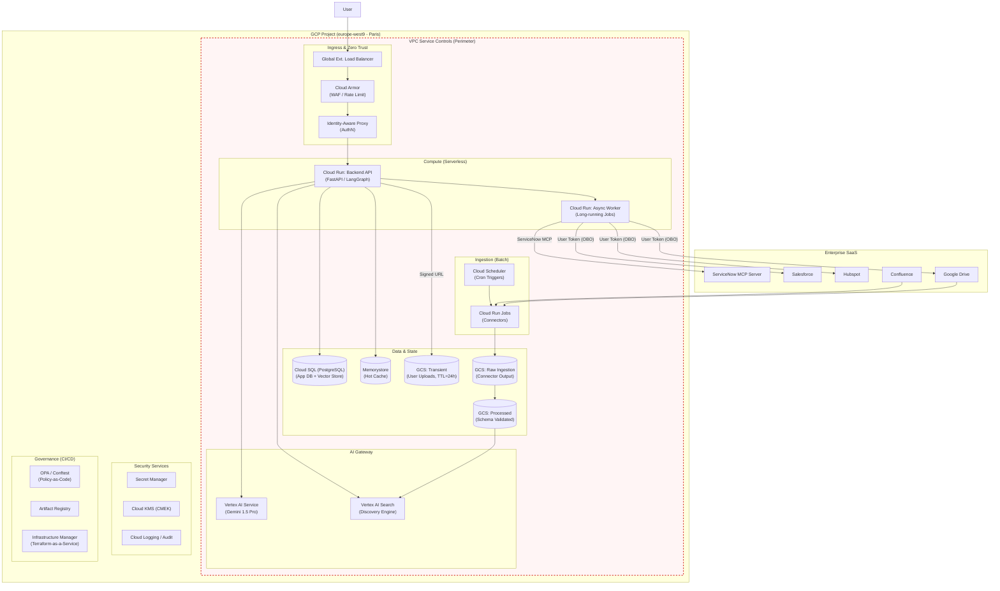
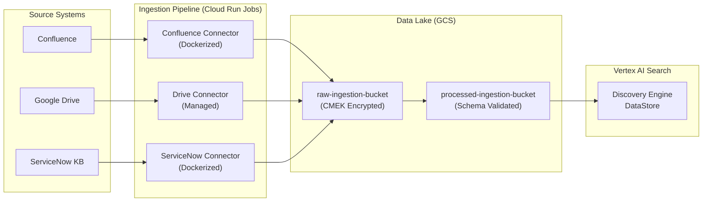

# Architecture Study: Mnabaa Agentic Platform

**Version**: 2.1
**Target Audience**: CTO, Architecture Board, Security Team
**Context**: Luxury Industry Retailer (25k Employees, EU/US)

---

## 1. Executive Summary & Context

To support the digital transformation of its internal services, the Client (Luxury Sector) wishes to deploy an **Agentic Platform** aimed at augmenting its internal support teams (IT & E-commerce). This platform evolves the existing static FAQ Chatbot into an intelligent orchestrator capable of acting on enterprise systems.

### 1.1. Strategic Objectives

| Objective                  | Description                                                                                              |
| :------------------------- | :------------------------------------------------------------------------------------------------------- |
| **Knowledge Activation**   | Unify access to dispersed knowledge (Confluence, Drive, BigQuery) without duplicating it.                |
| **Operational Efficiency** | Automate Level 1/2 actions via "Action Tools" (ServiceNow, Salesforce, CRM).                             |
| **Sovereignty & Trust**    | Guarantee **GDPR** compliance and **Zero Trust** security. Data & Models must strictly reside in **EU**. |
| **Scalability**            | Designed for global deployment (EU/US) with a focus on Observability and FinOps.                         |

### 1.2. Existing Ecosystem

- **Identity**: Google Cloud Identity (SSO).
- **Knowledge**: Confluence, Google Drive, BigQuery (Data Lake).
- **Operations**: ServiceNow (ITSM), Salesforce (Order Management), Hubspot (CRM).
- **Observability**: Cloud Logging, Cloud Monitoring, Grafana.

---

## 2. Logical Architecture (The "Virtual Team")

The solution mimics a **Virtual Team** where a "Supervisor" distributes work to "Specialist Agents".

### 2.1. Functional Component Diagram

```mermaid
graph LR
    subgraph Client ["Client Layer"]
        User(("User<br/>(Employee)"))
        WebApp["Web Chat Interface<br/>(React)"]
    end

    subgraph Orchestration ["Orchestration Layer (LangGraph)"]
        Supervisor["Supervisor Agent<br/>(Router & Planner)"]
        Memory["Thread State<br/>(Conversation History)"]
    end

    subgraph Specialists ["Specialist Team (CrewAI)"]
        Researcher["Agent: Knowledge<br/>(Confluence/Drive)"]
        ServiceNowAgent["Agent: ServiceNow<br/>(Dedicated MCP)"]
        Ops["Agent: Operations<br/>(Salesforce/Hubspot)"]
        Analyst["Agent: Data<br/>(BigQuery)"]
    end

    subgraph Tooling ["Tooling Protocol (FastMCP)"]
        direction TB
            T_Vision["Doc Vision<br/>(Transient Uploads)"]
            T_Search["Vertex AI Search<br/>(Corp Knowledge)"]
        end
        subgraph Tools_MCP ["MCP Servers (Custom Adapter)"]
            T_Snow["ServiceNow MCP<br/>(FastMCP Python)"]
        end
        subgraph Tools_Action ["Action Tools (Custom Adapter)"]
            T_Order["Order Mgmt<br/>(FastMCP Python)"]
        end
    end

    %% Flows
    User --> WebApp --> Supervisor
    Supervisor -- "Plan" --> Memory
    Supervisor -- "Delegate" --> Researcher & ServiceNowAgent & Ops & Analyst
    Researcher --> T_Search & T_Vision
    ServiceNowAgent --> T_Snow
    Ops --> T_Order
    Analyst --> T_Search

    %% Human in the Loop
    Supervisor -- "Uncertainty?" --> Feedback["Active Feedback Loop<br/>(Shadow Mode / User Validation)"]
```

### 2.2. Key Logic Patterns

1.  **Supervision Strategy**: The Supervisor acts as a Router. It decomposes complex requests tailored to specialists.
2.  **Sensitive Data (PII) Redaction**:
    - All user input flows through a **DLP (Data Loss Prevention)** layer.
    - Entities (Credit Cards, Phones, Emails) are masked _before_ reaching the LLM context.
3.  **Human-in-the-Loop**:
    - **Action Confirmation**: High-risk actions (e.g., "Delete User", "Refund Order") require explicit user confirmation via UI "Approval Card".
    - **Hallucination Control**: Users can "Flag" incorrect answers. This feedback is stored for "Shadow Mode" evaluation but does not automatically retrain the model (to avoid poisoning).

### 2.3. ServiceNow Agent (Custom FastMCP Adapter)

> [!TIP] > **Cost Optimization**: We avoid the official ServiceNow MCP Server because it requires an expensive **"GenAI Controller" (Pro Plus)** license.
> Instead, we build a lightweight **Custom MCP Server using FastMCP (Python)** that wraps standard ServiceNow REST APIs.

The **ServiceNow Agent** communicates via a dedicated **Cloud Run Service** hosting the custom Adapter:

| Capability              | Implementation (FastMCP) | Description                                                 |
| :---------------------- | :----------------------- | :---------------------------------------------------------- |
| **Ticket Management**   | `tools.create_incident`  | Wraps `POST /table/incident`. Free API usage.               |
| **Knowledge Access**    | `resources.kb_article`   | Wraps `GET /kb_knowledge`. No vector search license needed. |
| **Workflow Automation** | `tools.trigger_flow`     | Triggers existing Flow Designer flows via API.              |

**Architecture:**

```
┌────────────────┐     JSON-RPC 2.0     ┌────────────────────┐     REST API     ┌─────────────────┐
│ ServiceNow     │ ───────────────────► │ Cloud Run Service  │ ────────────────►│ ServiceNow      │
│ Agent (Mnabaa) │ ◄─────────────────── │ (MCP Middleware)   │ ◄────────────────│ Instance        │
└────────────────┘                      └────────────────────┘                  └─────────────────┘
```

**Benefits:**

- **Zero License Cost**: Uses standard REST APIs (Table API) already included in basic ITSM licenses.
- **Security Boundary**: The Adapter resides inside the VPC-SC perimeter.
- **Full Control**: We define exactly which fields are exposed, preventing accidental data leakage (DLP).

### 2.4. Supervisor Guardrails (The Gatekeeper)

As the entry point, the Supervisor requires strict guardrails to protect downstream agents.

| Guardrail Type         | Mechanism                           | Purpose                                                                                                                                                                            |
| :--------------------- | :---------------------------------- | :--------------------------------------------------------------------------------------------------------------------------------------------------------------------------------- |
| **Topic Adherence**    | **Classification Step**             | The Supervisor first checks: _"Is this query about Retail, IT, or HR?"_. If off-topic (e.g., "Write a poem"), it rejects immediately. Prevents burning tokens on irrelevant tasks. |
| **Prompt Injection**   | **Vertex AI Safety + Custom Regex** | Detects "Jailbreak" patterns (e.g., "Ignore system instructions") before they reach the planning logic.                                                                            |
| **Router Consistency** | **Structured Output Validation**    | A distinct validator ensures the Supervisor selects **existing** agents only. If it hallucinates a "Lawyer Agent", the system catches the error and retries.                       |
| **PII Data Leakage**   | **Cloud DLP / Presidio**            | Scans both **User Input** (to protect LLM) and **Agent Output** (to protect User) for sensitive patterns (IBAN, SSN, Phone) and redacts them.                                      |

---

## 3. Physical Architecture (GCP Secure Enclave)

The deployment targets **Google Cloud Platform (GCP)**, specifically the **europe-west9 (Paris)** region to satisfy strict data residency and latency requirements.

### 3.1. Infrastructure Diagram



### 3.2. Security & Compliance

| Domain               | Requirement      | Implementation Strategy                                                                                                                                                                                                                                                                                                                                                                                          |
| :------------------- | :--------------- | :--------------------------------------------------------------------------------------------------------------------------------------------------------------------------------------------------------------------------------------------------------------------------------------------------------------------------------------------------------------------------------------------------------------- |
| **Data Residency**   | **France / EU**  | All resources (Buckets, Datasets, Cloud Run, Vertex AI) forced to `europe-west9` via Org Policy.                                                                                                                                                                                                                                                                                                                 |
| **Network Security** | **Zero Trust**   | 1. **IAP**: Identity verification before traffic hits the container.<br>2. **VPC-SC**: Prevents data exfiltration even if IAM is compromised.                                                                                                                                                                                                                                                                    |
| **Authentication**   | **Hybrid Scope** | 1. **"On-Behalf-Of" (SaaS)**: For personal data (Drive, Mail), the Agent uses **Domain-Wide Delegation** to impersonate the specific user.<br>2. **"Virtual Employee" (BigQuery)**: For analytics, the Agent acts as a "Service Account" with **Least Privilege** access to specific Authorized Views.<br>3. **MCP Native Auth (ServiceNow)**: ServiceNow MCP uses instance credentials with scoped permissions. |
| **Secrets**          | No Hardcoding    | All API Keys/Credentials stored in **Secret Manager**.                                                                                                                                                                                                                                                                                                                                                           |

### 3.3. VPC-SC Operational Considerations

> [!WARNING]
> VPC Service Controls impose operational constraints that must be planned for.

| Constraint                                 | Impact                                             | Mitigation                                                     |
| :----------------------------------------- | :------------------------------------------------- | :------------------------------------------------------------- |
| **CD Blocked Inside Perimeter**            | GitHub/GitLab continuous deployment unavailable    | Use Cloud Build private pools                                  |
| **IAM Principal Ingress Not Supported**    | Cannot use developer identity for VPC-SC ingress   | Configure explicit ingress rules by IP/CIDR                    |
| **Developer Access**                       | Developers cannot deploy from laptops              | VPN/Bastion access with approved IPs                           |
| **Artifact Registry Must Be In-Perimeter** | Container images must be pulled from within VPC-SC | Mirror base images (python:slim) to internal Artifact Registry |
| **Cloud Build Requires Private Pools**     | Default shared pools are outside perimeter         | Provision dedicated Cloud Build private pools                  |

---

## 4. Data Strategy & Governance

### 4.1. The "Ephemeral RAG" (Transient Uploads)

**Requirement**: Users need to chat with a PDF _right now_, but this PDF must **NOT** pollute the corporate Knowledge Base.

- **Flow**:
  1.  User uploads file $\rightarrow$ Encrypted GCS Bucket (`TTL=24h`).
  2.  Agent parses file $\rightarrow$ Generates Embeddings in **Cloud SQL pgvector** (session-scoped table with TTL constraint).
  3.  Chat capabilities are bound to the storage lifespan.
  4.  **Cleanup**: Upon session close or TTL, data is deleted via scheduled Cloud SQL cleanup job. **No permanent index.**

> [!NOTE]
> We use **pgvector** instead of in-memory FAISS to avoid cold-start latency and memory pressure on Cloud Run containers. Session-scoped tables provide isolation and automatic cleanup.

### 4.2. Corporate Knowledge (Confluence / Drive)

**Decision**: **Vertex AI Search (Managed RAG)** with explicit ingestion pipeline.

- **Why?**
  - **Connectors**: Google Drive has a GA managed connector. Confluence requires a **custom connector** (see Section 4.4).
  - **Hybrid Search**: Superior ranking (Keyword + Semantic) compared to raw API calls.
  - **Multimodal**: Handles PDFs, Slides, and unstructured text natively.
- **Solution**: The **Knowledge Agent** uses the **Vertex AI Search Tool**.
  - It focuses on **Query Expansion** (refining user intent) and **Synthesis** (reading retrieval results).
  - It does **not** manage the index itself.

> [!WARNING]
> The Vertex AI Search Confluence connector is **Private Preview** (requires Google allowlisting). We use a **custom Cloud Run Job connector** to ensure production reliability.

### 4.3. Structured Data (BigQuery)

**Decision**: **Semantic Text-to-SQL Engine** (Schema Retrieval + Validation Layer).

- **Problem with "Naive" Text-to-SQL**:
  - Dump all schemas into Context = High Latency + High Cost + Hallucinations (merging columns from irrelevant tables).
  - Direct execution = Security risk (DROP TABLE).
- **Solution**: **Analyst Agent with "The Librarian" (Schema Retrieval)**.
  1.  **Schema Retrieval**: We do not feed the LLM _all_ tables. We embed table/column summaries in a Vector Store. The Agent "searches" for relevant tables first (e.g., "Sales", "Europe").
  2.  **Semantic Injection**: Top 5 relevant table schemas + "Few-Shot" approved SQL examples are injected into the context.
  3.  **Dry-Run Validator**: Before executing _any_ SQL, we run a `job_config=dry_run` query against BigQuery. This validates syntax and column existence **at zero cost** and zero risk.

**SQL Validation & Enhancement Layer** (prevents hallucinated queries):

| Check              | Implementation                                        | Purpose                           |
| :----------------- | :---------------------------------------------------- | :-------------------------------- |
| **SQL Library**    | **Few-Shot Prompting** with vector store of valid SQL | Improve accuracy by 40%+          |
| Schema Validation  | Parse SQL AST, verify columns exist in schema         | Prevent hallucinated column names |
| Row Limit          | Inject `LIMIT 1000` if missing                        | Prevent runaway queries           |
| Cost Estimation    | `EXPLAIN` before execution, block if > threshold      | Prevent expensive scans           |
| Blocklist Patterns | Regex for `DROP`, `DELETE`, `INSERT`, `UPDATE`        | Prevent data mutation             |

> [!TIP] > **SQL Strategy**: We do not rely on "Zero-Shot" SQL generation. The Agent receives 3-5 relevant, previously validated SQL queries (from the "SQL Library") to use as templates for the new request.

### 4.4. Enterprise Ingestion Pipeline

> [!IMPORTANT]
> Enterprise-grade ingestion requires explicit control over data flow, not implicit reliance on managed connectors.

**Architecture:**



**Ingestion Strategy by Source:**

| Source            | Connector Type                | Strategy                                                     | Scheduling               | Status |
| :---------------- | :---------------------------- | :----------------------------------------------------------- | :----------------------- | :----- |
| **Google Drive**  | ✅ Managed (Vertex AI Search) | Auto-sync with service account permissions                   | Continuous               | ✅ GA  |
| **Confluence**    | ⚙️ Custom (Cloud Run Job)     | Dockerized connector with Atlassian REST API + JSON Schema   | Hourly (Cloud Scheduler) | Custom |
| **ServiceNow KB** | ⚙️ Custom (Cloud Run Job)     | Dockerized connector with JSON Schema validation             | Daily (Cloud Scheduler)  | Custom |
| **Salesforce**    | ⚙️ Custom (Cloud Run Job)     | OAuth + Bulk API for historical, Streaming API for real-time | Hourly incremental       | Custom |

> [!IMPORTANT] > **Confluence connector is custom-built** because the Vertex AI Search managed connector is Private Preview and not production-ready. The custom connector provides:
>
> - Full control over space/page selection
> - JSON Schema validation before indexing
> - Explicit retry and error handling

**Components:**

- **Connector Microservices**: Each source has a dedicated Cloud Run Job container.
- **Raw Layer**: `gs://{project}-raw-ingestion/` - Preserves original documents (CMEK encrypted).
- **Processed Layer**: `gs://{project}-processed-ingestion/` - Schema-validated, normalized documents.
- **Batch Import**: Cloud Scheduler triggers Discovery Engine batch import after processing.

### 4.5. Data Contracts & Policy Enforcement

| Layer          | Enforcement                                                              | Tool                                 |
| :------------- | :----------------------------------------------------------------------- | :----------------------------------- |
| **Schema**     | All ingested documents must conform to versioned JSON Schema             | `jsonschema` validation in connector |
| **Quality**    | Automated data quality rules (null checks, range, referential integrity) | **Dataplex Auto Data Quality**       |
| **Policy**     | Infrastructure must pass OPA policies before apply                       | `conftest` in CI/CD                  |
| **Secrets**    | No secrets in code or config                                             | `tfsec` scan in CI/CD                |
| **IAM**        | Least privilege verified against baseline                                | OPA Rego policies                    |
| **Governance** | Fine-grained access control for BigQuery + GCS                           | **Dataplex** (Row/Column level)      |

---

## 5. Architectural Decision Records (ADR)

### 5.1. Orchestration Engine: LangGraph vs. Vertex AI Agent Builder

| Feature           | Vertex AI Agent Builder | LangGraph (Selected)     | Decision Validation                                                                                                                                 |
| :---------------- | :---------------------- | :----------------------- | :-------------------------------------------------------------------------------------------------------------------------------------------------- |
| **Orchestration** | Linear / Simple Loops   | **Cyclic State Machine** | **Required**. The "Supervisor" pattern requires complex retry loops, approvals, and error handling impossible in simple playbooks.                  |
| **Tools**         | OpenAPI / Data Stores   | **Python Code**          | **Required**. We need native Python integration for complex business logic and "Check-Before-Act" safety.                                           |
| **Observability** | "Black Box"             | **Native Monitoring**    | **Crucial**. In Luxury/Retail, we must be able to audit exactly _why_ an agent made a decision. Native state monitoring via built-in checkpointing. |
| **Cost**          | Per Query Markup        | **Compute + Tokens**     | **Cost-Effective**. High volume usage (25k users) is cheaper on raw compute (Cloud Run) than managed agent platforms.                               |

### 5.2. ServiceNow Integration: Custom FastMCP vs. Official MCP Plugin

| Feature            | Official ServiceNow MCP Plugin | Custom FastMCP Adapter (Selected) | Decision Validation                                                                                                          |
| :----------------- | :----------------------------- | :-------------------------------- | :--------------------------------------------------------------------------------------------------------------------------- |
| **License Cost**   | **High** (Requires Pro Plus)   | **Zero** (Standard REST API)      | **Critical**. Official plugin adds ~€50-100/seat/month equivalent in platform costs. Custom adapter uses existing API quota. |
| **Flexibility**    | Vendor Defined                 | **100% Custom**                   | We need specific filtering and DLP on ticket updates that the official plugin might not support granularly.                  |
| **Implementation** | Config-based                   | **Python Code** (Low Effort)      | `fastmcp` allows wrapping an API endpoint in <10 lines of code.                                                              |
| **Maintenance**    | Vendor Maintained              | Team Maintained                   | Trade-off accepted to save massive licensing costs.                                                                          |

---

## 6. Roadmap & Recommendations

### 6.1. Tech Stack & Skills

To build and run this platform, the internal team needs:

- **Core**: Python (FastAPI, LangGraph), Pydantic.
- **Cloud Ops**: Terraform (IaC), Google Cloud Run, IAM, Network Security.
- **Frontend**: React / Next.js (for the custom chat interface).
- **MCP Integration**: FastMCP client, ServiceNow MCP Server configuration.

### 6.2. Terraform Module Design

| Module       | Resources                                          | Dependencies              |
| :----------- | :------------------------------------------------- | :------------------------ |
| `networking` | VPC, Subnet, Serverless VPC Connector              | None                      |
| `security`   | KMS Keyring, CMEK Keys                             | None                      |
| `iam`        | Service Accounts, Workload Identity, Role Bindings | networking                |
| `compute`    | Cloud Run Services, Cloud Run Jobs                 | networking, iam, security |
| `data`       | Cloud SQL, Memorystore, GCS, Discovery Engine      | security, iam             |
| `monitoring` | SLOs, Alerts, Dashboards                           | compute, data             |
| `ingestion`  | Cloud Scheduler, Connector Jobs                    | compute, data             |

### 6.3. Cost Model (Estimation/Month)

_Assumptions: 1,000 MAU, 300,000 queries/month. **Hybrid Model Strategy**: 80% Routing/Simple (Gemini Flash), 20% Complex reasoning (Gemini Pro)._

| Component                  | Driver                      | Est. Cost (Low)  | Est. Cost (High) |
| :------------------------- | :-------------------------- | :--------------- | :--------------- |
| **Vertex AI (LLM)**        | **Hybrid (Flash + Pro)**    | €200             | €500             |
| **Vertex AI Search**       | Queries ($2/1k tiered)      | €600             | €1,000           |
| **Cloud Run (API+Worker)** | CPU/Memory (2vCPU, 4GB)     | €400             | €800             |
| **Cloud Run (MCP)**        | Dedicated Middleware        | €30              | €60              |
| **Cloud SQL (HA)**         | PostgreSQL + pgvector       | €250             | €400             |
| **Memorystore (Redis)**    | _Optional (Phase 2)_        | €0 (Local Cache) | €150             |
| **GCS (3 buckets)**        | Storage + operations        | €50              | €100             |
| **Secret Manager + KMS**   | Keys + secret access        | €50              | €80              |
| **Cloud Armor + LB**       | WAF rules + SSL             | €100             | €150             |
| **Logging/Monitoring**     | Log volume + custom metrics | €100             | €200             |
| **Dataplex**               | Data quality jobs           | €100             | €200             |
| **Evaluation (Dev)**       | Vertex AI Eval (CI/CD)      | €50              | €100             |
| **Subtotal**               |                             | €1,930           | €3,740           |
| **Contingency (20%)**      | Buffer for unknowns         | €386             | €748             |
| **Total**                  |                             | **~€2,316**      | **~€4,488**      |

> [!CAUTION] > **Gemini Pro Warning**: Purely using Gemini 1.5 Pro for 100% of traffic would increase LLM costs to ~€2,500/month. The **Hybrid Strategy** (Flash for Supervisor, Pro for Specialist) is critical for cost control.

### 6.4. Phasing

- **Phase 1 (MVP - 2 Months)**:
  - Scope: FAQ + Troubleshooting (Confluence only).
  - Tech: Cloud Run, Gemini 1.5, Basic Auth.
- **Phase 2 (Industrialization - 3 Months)**:
  - Scope: Action Tools (ServiceNow MCP integration).
  - Tech: VPC-SC, IAP, Binary Auth, Ephemeral RAG, Enterprise Ingestion Pipeline.
- **Phase 3 (Scale - 6 Months)**:
  - Scope: Full "Virtual Team" (Salesforce, Hubspot).
  - Tech: Fine-tuned Models, Global Multi-Region (if US expands), Full SRE Framework.

---

## 7. Observability & SRE

### 7.1. Service Level Objectives

| SLO                           | Target          | Alert Threshold | Measurement      |
| :---------------------------- | :-------------- | :-------------- | :--------------- |
| Simple Query Response         | p95 < 5s        | p95 > 8s        | Cloud Monitoring |
| Multi-Tool Query Response     | p95 < 15s       | p95 > 20s       | Cloud Monitoring |
| Knowledge Retrieval Freshness | 99.5% within 4h | > 6h lag        | Custom Metric    |
| Action Tool Success Rate      | 99%             | < 95% over 1h   | Cloud Run Logs   |
| ServiceNow MCP Availability   | 99.9%           | < 99% over 15m  | Uptime Check     |

> [!NOTE]
> Response time SLOs account for realistic latencies: LLM (1-3s), vector search (100-300ms), tool execution (500ms-2s), and routing (200-500ms).

### 7.2. Alerting Policies

| Alert Type                 | Trigger                                                         | Escalation              |
| :------------------------- | :-------------------------------------------------------------- | :---------------------- |
| **Connector Failure**      | Cloud Run Job exit code != 0                                    | PagerDuty → On-Call SRE |
| **LLM Token Budget**       | Daily spend > 80% of budget                                     | Email → FinOps Team     |
| **VPC-SC Violation**       | Audit Log: `google.cloud.compute.v1.VpcServiceControls.violate` | Security Incident → SOC |
| **ServiceNow MCP Timeout** | p99 latency > 10s                                               | Slack → Platform Team   |
| **High Error Rate**        | 5xx responses > 5% over 5m                                      | PagerDuty + Auto-scale  |

### 7.3. Runbooks

| Runbook                             | Trigger               | Key Steps                                                                                                                   |
| :---------------------------------- | :-------------------- | :-------------------------------------------------------------------------------------------------------------------------- |
| **Confluence Connector Failure**    | Ingestion job failure | 1. Check API credentials in Secret Manager<br/>2. Verify Confluence space permissions<br/>3. Retry with exponential backoff |
| **High LLM Latency**                | Agent response > 10s  | 1. Check Vertex AI quota usage<br/>2. Review concurrent request count<br/>3. Consider request queue                         |
| **ServiceNow MCP Connection Error** | MCP handshake failure | 1. Verify ServiceNow instance status<br/>2. Check MCP Server middleware logs<br/>3. Rotate credentials if expired           |
| **Action Tool Timeout**             | Tool execution > 30s  | 1. Check downstream service health<br/>2. Review user token validity<br/>3. Failover to async processing                    |

### 7.4. Dashboards

- **Executive Dashboard**: MAU, Query Volume, Success Rate, Cost per Query
- **SRE Dashboard**: SLOs, Error Budgets, Latency Percentiles, Alert Counts
- **FinOps Dashboard**: Token Usage, Compute Costs, Cost Attribution by Agent
- **Security Dashboard**: VPC-SC Events, IAM Changes, Secret Access Logs

---

## 8. CI/CD & Deployment

### 8.1. Container Registry

- **Artifact Registry**: `europe-west9-docker.pkg.dev/{project}/mnabaa`
- **Images**:
  - `backend-api`: FastAPI application with LangGraph
  - `async-worker`: Long-running job processor
  - `confluence-connector`: Confluence ingestion connector
  - `servicenow-connector`: ServiceNow KB ingestion connector

### 8.2. Build Pipeline (Cloud Build)

```mermaid
graph LR
    subgraph Validate["1. Validate"]
        Lint["Lint (Ruff)"]
        Type["Type Check (mypy)"]
        Security["Security Scan (tfsec)"]
    end

    subgraph Test["2. Test"]
        Unit["Unit Tests (pytest)"]
        Integration["Integration Tests"]
    end

    subgraph Build["3. Build"]
        Container["Build Container"]
        Push["Push to Artifact Registry"]
    end

    subgraph Deploy["4. Deploy"]
        Staging["Deploy to Staging"]
        Smoke["Smoke Tests"]
        Approval["Manual Approval"]
        Prod["Deploy to Production"]
    end

    Lint --> Type --> Security --> Unit --> Integration --> Container --> Push --> Staging --> Smoke --> Approval --> Prod
```



**Pipeline Steps:**

1. **Lint + Type Check**: Ruff, mypy (fail-fast).
2. **Security Scan**: tfsec for Terraform, Artifact Analysis for containers.
3. **Unit Tests**: pytest with coverage threshold (>80%).
4. **Prompt Evaluation**: Run `pytest` regression suite against "Golden Questions" using Vertex AI Evaluation / Ragas to check for quality degradation.
5. **Build Container Image**: Multi-stage Dockerfile.
6. **Push to Artifact Registry**: Tagged with Git SHA.
7. **Deploy to Staging**: Cloud Run revision with traffic split 0%.
8. **Smoke Tests**: Health checks + basic API verification.
9. **Manual Approval**: Required for production deployment.
10. **Deploy to Production**: Gradual traffic shift (10% → 50% → 100%).

### 8.3. Deployment Validation

| Check                     | Method               | Threshold             |
| :------------------------ | :------------------- | :-------------------- |
| **Health Endpoint**       | HTTP GET `/health`   | 200 OK within 5s      |
| **Discovery Engine Sync** | Document count API   | No decrease > 5%      |
| **Agent Availability**    | Test query execution | Success within 10s    |
| **MCP Connection**        | ServiceNow handshake | Established within 3s |

### 8.4. Infrastructure as Code (Terraform)

- **State Management**: GCS backend with CMEK encryption
- **Execution**: Infrastructure Manager (Terraform-as-a-Service)
- **Policy Enforcement**: Conftest with OPA policies in CI
- **Modules**: See Section 6.2 for module design

---

## 9. Appendix

### 9.1. GCP Native Services Summary

| Service                         | Purpose                                    | Status   |
| :------------------------------ | :----------------------------------------- | :------- |
| **Vertex AI Search**            | Managed RAG for unstructured knowledge     | ✅ GA    |
| **Vertex AI Search Connectors** | Drive: GA, Confluence: Private Preview     | ⚠️ Mixed |
| **Vertex AI (Gemini)**          | LLM for agent reasoning                    | ✅ GA    |
| **Cloud Run**                   | Serverless compute (API + Workers + Jobs)  | ✅ GA    |
| **Cloud SQL**                   | PostgreSQL for app data + pgvector         | ✅ GA    |
| **Memorystore**                 | Redis for hot cache                        | ✅ GA    |
| **Cloud Storage**               | Object storage (Transient, Raw, Processed) | ✅ GA    |
| **Secret Manager**              | Secrets & credentials                      | ✅ GA    |
| **Cloud KMS**                   | CMEK encryption                            | ✅ GA    |
| **VPC-SC**                      | Data exfiltration prevention               | ✅ GA    |
| **IAP**                         | Zero-trust authentication                  | ✅ GA    |
| **Cloud Armor**                 | WAF & DDoS protection                      | ✅ GA    |
| **Cloud Logging**               | Centralized logging                        | ✅ GA    |
| **Cloud Monitoring**            | Metrics & SLOs                             | ✅ GA    |
| **Dataplex**                    | Data governance & quality                  | ✅ GA    |
| **Artifact Registry**           | Container image storage                    | ✅ GA    |
| **Cloud Build**                 | CI/CD pipelines                            | ✅ GA    |

> [!IMPORTANT] > **Excluded Private Preview/Pre-GA Services**:
>
> - Vertex AI Search Confluence Connector (Private Preview) — replaced with custom Cloud Run Job
> - Vertex AI Search Access Control for third-party sources (Pre-GA) — plan manual access control

### 9.2. ServiceNow MCP Configuration

**Prerequisites:**

- ServiceNow instance with Generative AI Controller plugin (`com.sn.generative.ai`)
- MCP Server middleware deployed (Cloud Run or ServiceNow-hosted)
- Service account with appropriate ServiceNow roles

**MCP Server Capabilities:**

- `servicenow_search`: Search incidents, knowledge articles, requests
- `servicenow_create_incident`: Create new incidents
- `servicenow_update_record`: Update existing records
- `servicenow_get_user`: Retrieve user information
- `servicenow_create_change`: Create change requests
- `servicenow_workflow_trigger`: Trigger automated workflows

---
