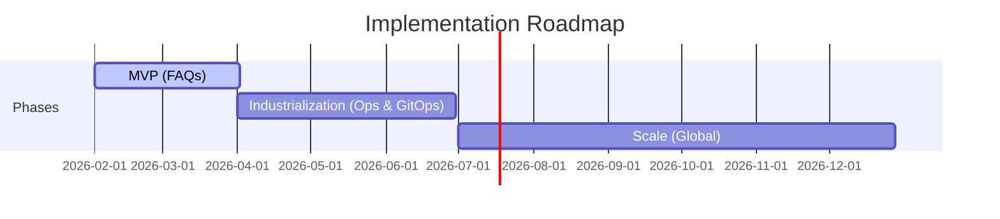

# C-Level Presentation: Mnabaa Agentic Platform

**Strategic Architecture Study**

---

## Slide 1: The Vision

**From "Static Chatbot" to "Sovereign Virtual Workforce"**

**The Goal**: Augment our 25k employees with a secure, AI-powered "Virtual Team" that executes complex tasks while adhering to strict EU data sovereignty.

**Strategic Drivers**:

1.  **Productivity**: Offload L1 Support & Ops actions to autonomous agents.
2.  **Sovereignty**: 100% EU Data Residency (GDPR) with Zero Trust architecture.
3.  **Ownership**: Owning the "AI Brain" vs renting "Black Box" SaaS copilots.

---

## Slide 2: Logical Architecture (The "Virtual Team")

**Governance by Orchestration. Execution by Standardized Protocols.**

- **Orchestrator**: The "Brain". Handles policy, routing, and compliance.
- **Specialists**: The "Workers". Focused on specific domains (IT, Ops, BI).
- **Standardized Connectors**: We trade "License Fees" for "Engineering Ownership" using **FastMCP (Python)**.
  - _Maintenance Strategy_: Strictly typed schemas (Pydantic) and automated contract testing ensure stability when SaaS APIs change.

---

## Slide 3: Supervisor Guardrails (Safety First)

**How we prevent hallucinations and misuse at the front door.**

The Supervisor is our "Gatekeeper". It runs strict checks **before** routing any request:

1.  **Topic Adherence**: Zero-shot classification rejects off-topic queries (e.g., "Write a poem") to save compute costs.
2.  **Prompt Injection Shield**: Vertex AI Safety filters + Custom Regex block "Jailbreak" attempts.
3.  **Router Consistency**: Structured Output Validation ensures the Supervisor interacts _only_ with valid agents.
4.  **PII Reduction Firewall**:
    - **Cloud DLP** automatically masks credit cards, phones, and emails **before** the prompt hits the LLM.

---

## Slide 4: Hybrid RAG Strategy (The Brain)

**Right Tool for the Right Data. Privacy per Design.**

| Data Type                                       | Strategy                 | Security & Validation                                                                                                      |
| :---------------------------------------------- | :----------------------- | :------------------------------------------------------------------------------------------------------------------------- |
| **Corporate Knowledge** (Confluence, Drive) | **Vertex AI Search**     | Secure, multimodal (PDFs/Slides). **No training on data.** ACLs preserved.                                                 |
| **Structured Business Data** (BigQuery)     | **Semantic Text-to-SQL** | **Dry-Run Validator**: We verify SQL syntax and column existence _before_ execution. Read-only access via Service Account. |
| **Transient Uploads** ("Read this PDF now") | **Ephemeral RAG**        | **Malware Scanned** -> Encrypted -> Embedded -> **Deleted after 24h**. Zero long-term storage of user files.               |

---

## Slide 5: Physical Architecture (Secure Enclave)

**Deployment: GCP Europe-West9 (Paris)**

- **Zero Trust Ingress**: Identity-Aware Proxy (IAP) verifies user identity. No VPN required, but stronger than VPN.
- **Data Exfiltration Protection**: **VPC Service Controls** prevent data from leaving our defined perimeter, even if credentials are compromised.

---

## Slide 6: Secure Operations (Egress & Latency)

**Connecting to the Enterprise safely.**

1.  **Identity Propagation ("On-Behalf-Of")**:
    - The agent impersonates the user. It sees _only_ what the user is allowed to see (preserving existing Salesforce/Drive ACLs).
2.  **Controlled Egress**:
    - Traffic flows through **Cloud NAT** with static IPs allowlisted by SaaS providers.
3.  **Latency Management**:
    - **Streaming API**: Updates are pushed to the UI in real-time to mitigate the latency of multi-hop agent reasoning.

---

## Slide 7: Operational Maturity (Day 2)

**How we run, monitor, and fix it.**

| Capability        | Implementation                                 | Value                                                                                                                                                                    |
| :---------------- | :--------------------------------------------- | :----------------------------------------------------------------------------------------------------------------------------------------------------------------------- |
| **Observability** | **Native State Monitoring** (LangGraph Native) | Real-time visibility into state changes and checkpoints without external tools. - **Audit Trail**: All agent actions are tied back to the IAP-authenticated user ID. |
| **QA & Testing**  | **"Golden Dataset" Regression**                | CI/CD pipeline runs 100+ standard questions to ensure new code doesn't degrade answer quality.                                                                           |
| **Resilience**    | **Circuit Breakers**                           | Graceful degradation if a tool (e.g., ServiceNow) is slow or down.                                                                                                       |

---

## Slide 8: TCO & Roadmap

**Investment Profile**

- **Infrastructure OpEx**: **~€3,800 / month** (Cloud Run, Vector DB, LLM Tokens for 1k users).
- **Operational Team**: Requires **~1.5 FTE** (Platform Engineer + Data Steward) to maintain connectors and governance.

- **Phase 1**: FAQ/Knowledge (Focus on Security & Hosting).
- **Phase 2**: Industrialization (Focus on CI/CD, Observability, and Action Capabilities).
- **Phase 3**: Global Rollout.

---

## Slide 9: Conclusion

**Why Mnabaa?**

1.  **Secure**: Built for Luxury standards (EU Residency, VPC-SC, Zero Trust).
2.  **Control**: We own the "Brain" and the "Connectors" (No Black Box SaaS).
3.  **Mature**: Designed for "Day 2" operations with full observability and regression testing.

**Ask**: Approval for **Phase 1 (MVP)** to validate the security model and deflection rates.

---
