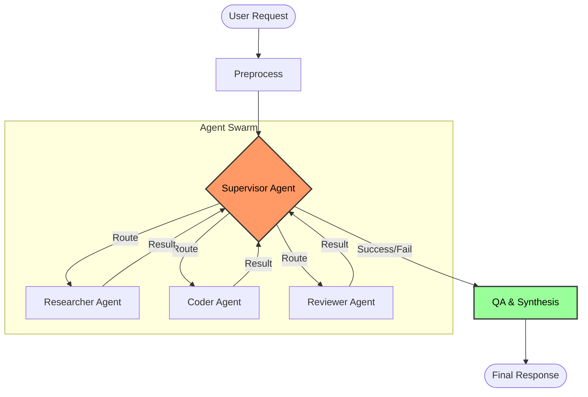
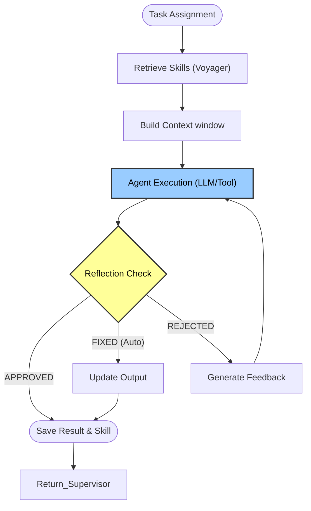
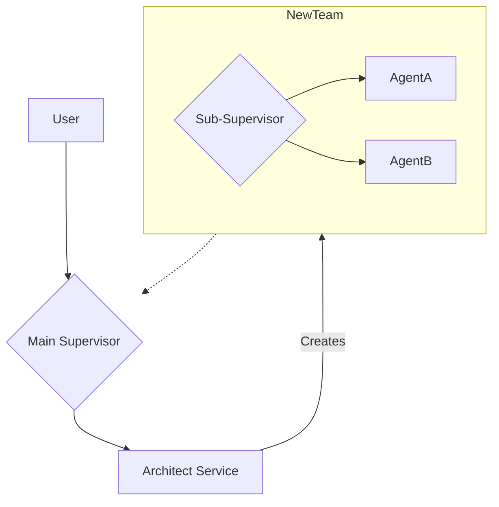

# Agentic Orchestrator Swarm Architecture

This document details the technical implementation of the Agentic Orchestrator Swarm flow. It is designed to provide a comprehensive understanding of the entire lifecycle of an agentic request, from the initial prompt to the final state transition.

## 1. High-Level Overview

The system implements a **Plan-and-Execute** architecture using a star-graph orchestrator pattern. A central **Supervisor** (Orchestrator) manages the state and routes tasks to specialized **Agents** (or Sub-Swarms).

Key characteristics:
*   **Orchestration**: Centralized decision-making via a Supervisor.
*   **Dynamic Plans**: The Plan is mutable and evolves as agents return results.
*   **One Agent, One Tool Pattern**: Each MCP Server is dynamically exposed as a specialized agent to the orchestrator.
*   **Self-Correction**: Agents implement a "Tri-State Reflection" loop to self-heal output before returning it to the supervisor.
*   **Memory**: "Voyager-style" skill retrieval allows agents to learn from past successful executions.

---

## 1.1. Software Stack & Versioning

The system is built on a modern, strictly typed Python 3.12+ stack, leveraging the latest advancements in Agentic Frameworks.

| Library | Version | Purpose |
| :--- | :--- | :--- |
| **Python** | `>=3.12` | Core Runtime (AsyncIO Native) |
| **FastAPI** | `>=0.128.0` | High-performance Web Framework |
| **LangGraph** | `>=1.0.7` | Stateful Graph Orchestration (Cyclic) |
| **LangGraph-Postgres** | `>=3.0.2` | Persistent State Checkpointer |
| **CrewAI** | `>=1.9.2` | Agent Abstractions & Tool execution |
| **LangChain** | `>=1.2.7` | LLM Interface & Prompt Management |
| **FastMCP** | `>=2.14.0` | MCP Server Wrapper |
| **MCP (Core)** | `>=1.23.1` | Model Context Protocol Specification |
| **LangFuse** | `>=3.12.1` | Observability & Tracing |
| **Pydantic** | `>=2.11.9` | Data Validation & Schema Enforcement |

---

## 2. State Management (`GraphState`)

The "Brain" of the system is the `GraphState`, a typed dictionary that persists throughout the graph execution.

### Schema (`src/models/state.py`)

```python
class GraphState(TypedDict):
    input_request: str                        # The original user intent
    messages: Annotated[List[Any], operator.add] # Append-only chat history
    tasks: Annotated[List[Dict], operator.add]   # Log of all tasks created
    results: Annotated[List[Dict], operator.add] # Log of all agent outputs
    plan: Annotated[List[str], lambda x, y: y]   # The current active plan (overwritten)
    global_state: Annotated[Dict, merge_dict]    # Shared context/knowledge
    citations: Annotated[List[Citation], operator.add] # Source tracking
    next_step: Optional[List[str]]               # Routing destination
```

### Key Concepts
*   **Reducers (`operator.add`)**: Fields like `messages` and `results` are append-only. The system never "forgets" events, ensuring full traceability.
*   **Global State**: A shared blackboard (`global_state`) allows agents to pass structured data (like file paths or partial answers) without clogging the chat context.

---

## 3. The Core Graph Pattern (Supervisor-Star)

The architecture uses a **Star Graph** where the Supervisor sits in the center. All agents return to the Supervisor, which then decides the next move.

### Flow Logic (`src/brain/graph.py`)

1.  **Preprocess**: Validates input and initializes state.
2.  **Supervisor**: Analyzes state -> Updates Plan -> Routes to Agent.
3.  **Agent Execution**: Agent performs task -> Returns Result -> Back to Supervisor.
4.  **QA**: Consolidates final answer -> END.

### Mermaid Diagram: Orchestration Flow



---

## 4. The Orchestrator (The "Supervisor")

The Supervisor is not just a router; it is a **Planner**. It uses the `Plan-and-Execute` pattern to break down complex requests.

### Techniques Used
1.  **Orchestrator Prompt (`src/brain/prompts.py`)**:
    *   **XML Context Tags**: `<session_history>`, `<current_plan>`, `<state_context>` isolate input sections to prevent prompt injection and hallucinations.
    *   **JSON Enforcement**: The LLM must return valid JSON containing the `thought_process`, `selected_agents`, and the updated `plan`.

2.  **Circuit Breaker (`src/brain/nodes/supervisor.py`)**:
    *   Prevents infinite loops.
    *   **Logic**: If the Supervisor routes to the same agent twice in a row without state progression, the `retry_count` increments.
    *   **Trigger**: If `retry_count >= 2`, the system forces a route to `QA` to fail gracefully or ask for clarification.

---

## 5. Agent Execution Flow (The "Worker")

Agents are independent execution units. They do not know about the full graph; they simply receive a task and return a result.

### The Execution Pipeline (`src/brain/nodes/execution.py`)

1.  **Task Retrieval**: Fetches the specific `AgentTask` object assigned by the Supervisor.
2.  **Skill Retrieval (Voyager)**:
    *   Queries a vector DB for similar *past successful tasks*.
    *   Injects the `solution_code` of those past tasks into the context as "Few-Shot Examples".
3.  **Context Injection (Blindness Fix)**:
    *   Agents cannot see the entire chat history (to save tokens).
    *   We inject: `Available Artifacts` keys + `Last 5 Messages` + `Relevant Skills`.
4.  **Execution & Reflection (Self-Correction)**:
    *   **Execution**: The agent generates an output (via Tool or LLM).
    *   **Reflection Loop**: A separate LLM call critiques the output using the `REFLECTION_PROMPT`.

### The Tri-State Reflection Protocol

The Reflector evaluates the output and returns one of three statuses:
*   **APPROVED**: Structure is perfect. -> *Return result.*
*   **FIXED**: Minor syntax error found. -> *Auto-fix and return.*
*   **REJECTED**: Major logic error. -> *Send feedback to agent and RETRY loop.*

### Mermaid Diagram: Agent Execution Loop



---

## 6. Prompt Engineering Techniques

All prompts in `src/brain/prompts.py` follow "Agentic Best Practices v2.0".

### 1. XML Context Tagging
We wrap all dynamic inputs in XML tags. This helps the LLM distinguish between "Instructions" and "Data".

```text
### GLOBAL CONTEXT
<user_request>
{request}
</user_request>

<state_context>
{state_json}
</state_context>
```

### 2. Role-Based Specialized Personas
Agents are not "Helpful Assistants". They are "Specialized Processes".
*   **Example**: "You are a function-calling engine. You do not talk; you execute."
*   **Why**: Drastically reduces "chattiness" and increases tool usage reliability.

### 3. Programmatic Output (JSON Mode)
Crucial for the Orchestrator and Reflector. We do not parse Natural Language for routing. We parse JSON.
*   **Orchestrator**: Returns `{ "selected_agents": ["..."], "plan": [...] }`
*   **Reflector**: Returns `{ "status": "APPROVED", "refined_output": "..." }`

---

## 7. Dynamic MCP Agent Generation (The One-Agent-One-Tool Pattern)

The system automatically scales its capabilities by mapping **MCP Servers** directly to **Specialized Agents**. This ensures that the Orchestrator works with atomic, single-responsibility units rather than overloaded generalists.

### The Problem
Traditional agents are often given 20+ tools. This confuses the LLM (Context Window saturation).

### The Solution: 1 MCP Server = 1 Specialized Agent
When the system starts (or when `registry.reload()` is called):

1.  **Scanning**: The `AgentRegistry` queries the **MCP Service** for all active servers (e.g., `filesystem`, `s3`, `google-maps`).
2.  **Wrappers**: For each server found, the registry dynamically generates an Agent Configuration.
3.  **Specialization Prompts**: A strict prompt template (`DYNAMIC_AGENT_BACKSTORY`) is used to force the agent to ignore general knowledge and **ONLY** use the provided toolset.

### Code Logic (`src/brain/registry.py`)

```python
# Pseudo-logic flow
servers = mcp_service.get_all_servers()
for server in servers:
    # 1. Create unique name
    agent_name = f"mcp_agent_{server.name}"
    
    # 2. Bind ONLY this server
    agent_config = AgentConfig(
        role="{server.name} Specialist",
        goal="You are a function-calling engine. You do not talk; you execute.",
        mcp_servers=[server.name], # <-- The key constraint
    )
    
    # 3. Register as Node
    registry.register(agent_name, agent_config)
```

### Resulting Architecture
The Supervisor sees a menu of highly specialized tools masquerading as agents:
*   `mcp_agent_filesystem` -> "I can read/write files."
*   `mcp_agent_math` -> "I can calculate things."
*   `mcp_agent_s3` -> "I can upload/download blobs."

This drastically improves routing accuracy because the Supervisor (Planner) assigns the task to the **Agent** (which is just a wrapper for the toolset), and the Agent (Worker) has no other distraction but to call that tool.

---

## 8. The Architect Service (Meta-Agent)

The **Architect** is a specialized service that acts as a "Agent Generator". It allows the user to ask for a custom workflow, and the system will design, compile, and register it on the fly.

### The "SaaS in a Box" Pattern
When a user asks: *"Build me a team that research stocks and writes a Python report"*, the Architect Service takes over:

1.  **Decomposition Prompt (`ARCHITECT_PROMPT`)**:
    *   Input: User Goal + List of Available MCP Tools (e.g. `yahoo_finance`, `code_interpreter`).
    *   Output: A JSON Schema defining a **New Supervisor-Star Graph**.

2.  **Schema Validation**: 
    *   The Architect ensures strict "Single Purpose" agents. 
    *   It creates a `StockResearcher` agent (bound to `yahoo_finance` tool) and a `ReportWriter` agent (bound to `file_writer`).

3.  **Recursive Registration**:
    *   The new Graph is saved to the `workflows` table.
    *   **Hot Reload**: The system hot-reloads the `AgentRegistry`.
    *   **Recursive Usage**: The *Main Supervisor* now sees this new Team as a single "Node" called `stock_report_team`.

### Mermaid: Recursive Composition


---

## 9. Observability & Tracing (LangFuse)

The system is instrumented with **LangFuse** to provide "X-Ray Vision" into the Graph execution.

### Implementation (`src/core/observability.py`)

We use a custom `AntigravityCallbackHandler` that injects metadata into every LLM call.

### Key Metrics Tracked
*   **Trace ID**: Maps 1:1 with the User's `Thread ID`.
*   **Session ID**: Stateless sessions mapped deterministically from Trace IDs.
*   **Tags**:
    *   `agent_name`: Which agent performed the action.
    *   `reflection_status`: Did the agent pass/fail reflection?
    *   `tool_usage`: Which MCP tools were called.

### The "Full Trace" View
Every step is visible in the LangFuse UI:
1.  **Graph Transition**: Supervisor -> Agent A.
2.  **Agent Thought**: "I need to look for files..."
3.  **MCP Tool Call**: `filesystem.list_dir("/src")`
4.  **Tool Output**: `["file1.py", "file2.py"]`
5.  **Reflection Step**: "Output looks good."

This granularity allows us to debug *why* a Plan failed (e.g., "The tool returned an error, but the agent ignored it").
